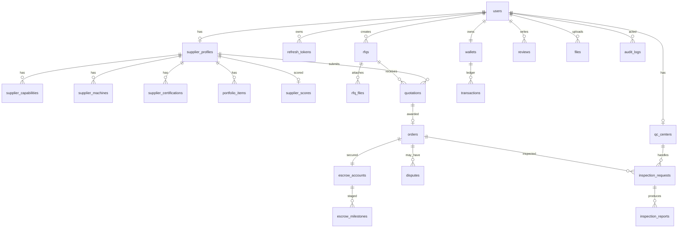

# گزارش معماری — PartMachine

> نسخه ۱.۰ — تاریخ: ۲۰۲۶/۰۶/۱۲ — وضعیت: مصوب برای افزایش ۱

## ۱. نمای کلی

PartMachine یک بازار صنعتی B2B است که پنج نقش اصلی دارد: تأمین‌کننده (قطعه‌ساز)، کارفرما (خریدار)، مأمور خرید، مرکز کنترل کیفیت (QC) و مدیر پلتفرم. هدف: مقیاس‌پذیری تا +۱۰۰هزار کاربر و میلیون‌ها رکورد.

## ۲. معماری کلان

```
[Next.js 16 (RTL/fa)] ──HTTPS──> [FastAPI v1 REST]
                                     │
                  ┌──────────────────┼──────────────────┐
            [PostgreSQL 17]      [Redis 7]         [MinIO / S3]
            (داده‌ی اصلی)     (کش/سشن/صف/ریت‌لیمیت)  (فایل‌های CAD/PDF)
                                     │
                              [AI Services Layer]
                     (Trust Score | Matching | Fraud | Doc Analysis)
```

### تصمیم‌های کلیدی (ADR خلاصه)

| # | تصمیم | دلیل |
|---|---|---|
| 1 | Monorepo با `frontend/` و `backend/` | استقرار هماهنگ، CI ساده‌تر، قرارداد API مشترک |
| 2 | REST نسخه‌دار (`/api/v1`) با OpenAPI | پایداری قرارداد برای کلاینت‌های آینده (موبایل) |
| 3 | JWT کوتاه‌عمر (۱۵ دقیقه) + Refresh Token چرخشی در DB | امنیت + امکان ابطال + تشخیص استفاده مجدد (reuse detection) |
| 4 | RBAC با نقش پایه + مجوزهای ریز در لایه‌ی سرویس | پنج نقش مشخص با مرز روشن |
| 5 | پول به‌صورت `BIGINT` به ریال (IRR) | جلوگیری از خطای اعشاری؛ درگاه‌های ایرانی ریالی‌اند |
| 6 | موتورهای AI به‌صورت سرویس ماژولار با اینترفیس مشترک | تعویض‌پذیری مدل/Provider بدون تغییر API |
| 7 | آپلود فایل با Presigned URL مستقیم به S3 | عدم عبور فایل سنگین CAD از API server |
| 8 | فرانت RTL-first با Tailwind v4 و توکن‌های تم | بازار ایران، فارسی‌زبان |

## ۳. فرانت‌اند

- **Next.js 16 (App Router)** — Server Components به‌صورت پیش‌فرض؛ Client Components فقط برای تعامل (فرم‌ها، استورها).
- **TailwindCSS v4** — پیکربندی CSS-first با `@theme`؛ فونت وزیرمتن؛ `dir="rtl"` در ریشه.
- **shadcn/ui-style** — کامپوننت‌های ui داخل `src/components/ui` با CVA.
- **React Query v5** — داده‌ی سرور (لیست تأمین‌کننده‌ها، RFQها)؛ کش و revalidate.
- **Zustand v5** — وضعیت کلاینت (سشن کاربر، UI state).
- **لایه‌ی API** (`src/lib/api.ts`) — کلاینت fetch با مدیریت توکن و refresh خودکار؛ تا آماده‌شدن بک‌اند، روی Mock Data به‌صورت fallback کار می‌کند.

### ساختار مسیرها

```
/                  → لندینگ
/login /register   → احراز هویت
/suppliers         → جستجو و فیلتر تأمین‌کننده‌ها
/suppliers/[id]    → پروفایل تأمین‌کننده (توانمندی، ماشین‌آلات، گواهی، امتیاز اعتماد)
/rfqs              → لیست RFQهای من
/rfqs/new          → ثبت RFQ (آپلود CAD/PDF، متریال، تعداد، مهلت)
/dashboard         → داشبورد نقش‌محور
```

## ۴. بک‌اند (افزایش ۲ — طراحی‌شده)

- FastAPI + Python 3.13، SQLAlchemy 2.x async + asyncpg، Pydantic v2، Alembic.
- ساختار لایه‌ای: `api/v1` (روتر) → `services` (منطق دامنه) → `models` (ORM).
- امنیت: Argon2 برای هش رمز، Rate limit مبتنی بر Redis، Audit Log برای تمام اکشن‌های حساس، اعتبارسنجی MIME و امضای فایل در آپلود.
- Observability: structlog (JSON)، `/health` و `/metrics` (Prometheus)، Request-ID middleware.

## ۵. طرح دیتابیس (ERD خلاصه)



### نکات مقیاس‌پذیری

- ایندکس‌های ترکیبی روی `(status, created_at)` برای RFQ و سفارش‌ها؛ GIN روی فیلدهای JSONB و جستجوی متنی (pg_trgm).
- پارتیشن‌بندی `audit_logs` و `transactions` بر اساس ماه (RANGE on created_at).
- شناسه‌ها UUIDv7 (ترتیب‌پذیر، مناسب ایندکس B-Tree).
- خواندن‌های سنگین (جستجوی تأمین‌کننده، امتیازها) پشت کش Redis با TTL.

## ۶. موتورهای AI (معماری ماژولار)

هر موتور یک سرویس مستقل با اینترفیس مشترک `score(input) -> ScoredResult(value, components, explanation)`:

1. **Trust Score** — مدل وزن‌دار explainable روی: تحویل به‌موقع، امتیاز کیفیت، نرخ ردی، رضایت مشتری، تعداد کار تکمیل‌شده، سرعت پاسخ، سابقه‌ی اختلاف → خروجی: Trust / Risk / Reliability / Quality (۰–۱۰۰) + توضیح هر مؤلفه.
2. **Matching Engine** — رتبه‌بندی تأمین‌کننده برای هر RFQ: تطبیق توانمندی، فاصله‌ی جغرافیایی، عملکرد تحویل، کیفیت، ظرفیت آزاد، سابقه.
3. **Fraud Detection** — قواعد + ناهنجاری‌یابی (قیمت غیرعادی، الگوی ریویو جعلی، ثبت‌نام مشکوک).
4. **Document Analysis** — اینترفیس Provider-محور برای LLM (استخراج هزینه‌ی متریال/دستمزد/مالیات/بیمه/حمل از قرارداد و فاکتور). اتصال Provider در افزایش ۴.

اجرای کارهای سنگین AI به‌صورت async از طریق صف Redis.

## ۷. Escrow

ماشین حالت: `FUNDED → LOCKED → IN_PRODUCTION → QC_PASSED → BUYER_CONFIRMED → RELEASED` با شاخه‌های `REFUNDED` و `DISPUTED`. آزادسازی جزئی و مرحله‌ای از طریق `escrow_milestones`. درگاه پرداخت پشت اینترفیس `PaymentGateway` (پیاده‌سازی آینده: زرین‌پال و…).
